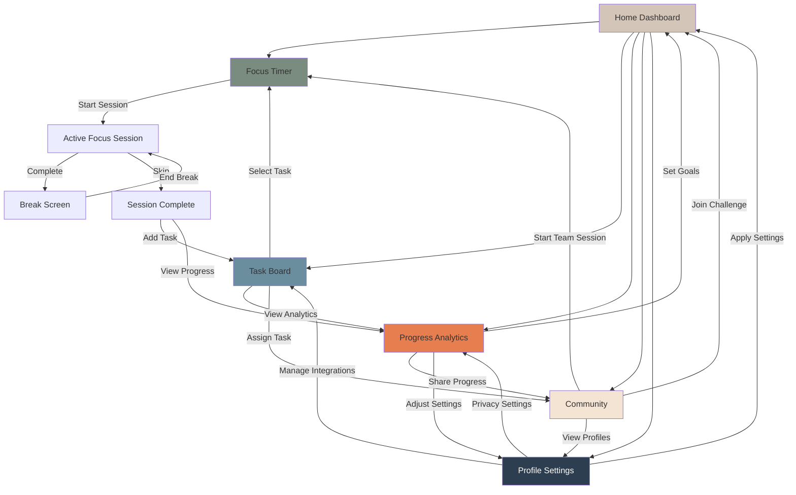
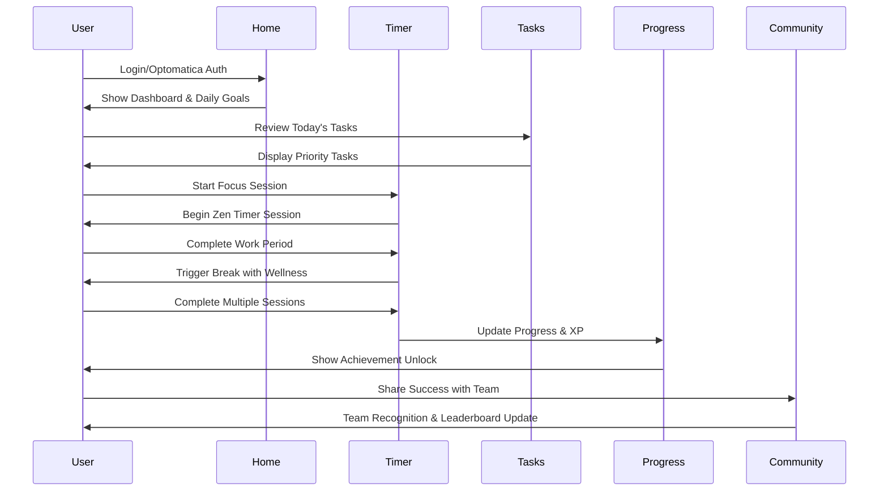
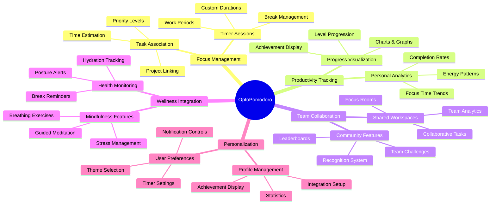

# OptoPomodoro UI/UX Design Specifications

## Introduction & Design Philosophy

This document provides detailed ASCII art layouts and visual specifications for the OptoPomodoro web application. The designs translate the conceptual framework from ProductDesign.md into implementation-ready visual blueprints that development teams can build from directly.

### Design Principles

**Zen Minimalism**: Clean, uncluttered interfaces that promote focus and calm
**Progressive Enhancement**: Mobile-first designs that gracefully enhance to desktop
**Accessibility First**: WCAG 2.1 AA compliance as a foundation, not an afterthought
**Gamification Integration**: Playful elements that enhance rather than distract from productivity

### ASCII Wireframing Methodology

The ASCII layouts use these conventions:
- `[ ]` = Interactive elements (buttons, inputs)
- `|` `─` `┌` `┐` `└` `┘` = Structural borders and containers
- `•` `○` `◆` = Visual indicators and status markers
- Text placement indicates hierarchy and spacing
- Responsive variations shown side-by-side

### Responsive Breakpoints

- **Mobile**: 320px - 768px (single column, touch-optimized)
- **Tablet**: 768px - 1024px (two-column, hybrid touch/mouse)
- **Desktop**: 1024px+ (multi-column, mouse-optimized)

---

## Screen 1: Focus Timer Screen

### Mobile Layout (320px - 768px)

```
┌─────────────────────────────────────┐
│ ☰  OptoPomodoro        🔔 👤  🔆   │
├─────────────────────────────────────┤
│                                     │
│              ┌───────┐              │
│          ╭───┤ 25:00 ├───╮          │
│          │   └───────┘   │          │
│          │   ○○○○○○○○   │          │
│          │  ○   TIMER   ○  │          │
│          │  ○             ○  │          │
│          │   ○○○○○○○○   │          │
│          │               │          │
│          └───────────────┘          │
│                                     │
│        🌿 🪨 💧 🎋                   │
│      Zen Garden Active               │
│                                     │
│  ┌─────────────────────────────┐    │
│  │ 🎧 Current Task: UI Design   │    │
│  │ ⏱️ Session 3 of 4           │    │
│  └─────────────────────────────┘    │
│                                     │
│    [  PAUSE  ]    [  SKIP  ]        │
│                                     │
│  ────────────────────────────────── │
│  🔇 Focus Mode  🌙 Ambient Sounds   │
│                                     │
├─────────────────────────────────────┤
│  🏠  ⏰  📋  📊  👥  ⚙️             │
└─────────────────────────────────────┘
```

### Tablet Layout (768px - 1024px)

```
┌─────────────────────────────────────────────────────────────┐
│ ☰  OptoPomodoro                        🔔 👤  🔆           │
├─────────────────────────────────────────────────────────────┤
│                                                             │
│                         ┌─────────────┐                    │
│                     ╭────┤   25:00    ├───╮                │
│                     │   └─────────────┘   │                │
│                     │    ○○○○○○○○○○    │                │
│                     │  ○    TIMER      ○  │                │
│                     │  ○               ○  │                │
│                     │    ○○○○○○○○○○    │                │
│                     │                   │                │
│                     └───────────────────┘                │
│                                                             │
│  🌿 🪨 💧 🎋 🍃 🪵 💎                                       │
│            Expanded Zen Garden                              │
│                                                             │
│  ┌─────────────────┐  ┌─────────────────┐  ┌─────────────┐ │
│  │ 🎧 UI Design    │  │ 📊 Analytics    │  │ 🧘 Wellness  │ │
│  │ ⏱️ Session 3/4  │  │ 🎯 78% Focus   │  │ 💆 Take Break│ │
│  │ ⚡ High Energy  │  │ 🔥 5 Day Streak│  │ 🌿 3 Breaths │ │
│  └─────────────────┘  └─────────────────┘  └─────────────┘ │
│                                                             │
│         [    PAUSE    ]        [    SKIP    ]               │
│                                                             │
│  ────────────────────────────────────────────────────────── │
│  🔇 Focus Mode  🎵 Forest Sounds  📱 Mobile Sync  ⚙️ Settings│
│                                                             │
├─────────────────────────────────────────────────────────────┤
│  🏠  ⏰  📋  📊  👥  ⚙️                                         │
└─────────────────────────────────────────────────────────────┘
```

### Desktop Layout (1024px+)

```
┌─────────────────────────────────────────────────────────────────────────────┐
│ ☰ OptoPomodoro                                    🔔 👤  🔆   📊  💡        │
├─────────────────────────────────────────────────────────────────────────────┤
│                                                                             │
│                            ┌─────────────────────┐                         │
│                        ╭───┤      25:00         ├───╮                     │
│                        │   └─────────────────────┘   │                     │
│                        │      ○○○○○○○○○○○○○○      │                     │
│                        │   ○       TIMER       ○   │                     │
│                        │   ○                   ○   │                     │
│                        │      ○○○○○○○○○○○○○○      │                     │
│                        │                         │                     │
│                        └─────────────────────────┘                     │
│                                                                             │
│  🌿 🪨 💧 🎋 🍃 🪵 💎 🌸 🍁 🌺                                               │
│                    Full Zen Garden Experience                               │
│                                                                             │
│  ┌──────────────────┐  ┌──────────────────┐  ┌──────────────────┐       │
│  │ 🎯 Current Task  │  │ 📊 Session Stats │  │ 🧘 Wellness      │       │
│  │ UI/UX Design     │  │ ┌─────┐ Focus:   │  │ 💆 Next Break:   │       │
│  │ ████████████░░ 80%│  │ │ 78% │ 2h 15m  │  │ 5:00 PM         │       │
│  │ ⏱️ 3h remaining   │  │ └─────┘ Streak:   │  │ 🌿 3/10 Breaths │       │
│  │ ⚡ High Energy    │  │ 🔥 5 days         │  │ 💧 Hydrate Soon  │       │
│  └──────────────────┘  └──────────────────┘  └──────────────────┘       │
│                                                                             │
│  ┌─────────────────────────────────────────────────────────────────────┐   │
│  │ 🎵 Ambient: Forest Rain   🌡️ Room Temp: 72°F   📱 Devices: 3 online │   │
│  │ 🔇 Notifications: Off     💡 AI Tip: "Posture check in 10 min"       │   │
│  └─────────────────────────────────────────────────────────────────────┘   │
│                                                                             │
│        [      PAUSE SESSION      ]        [      SKIP BREAK      ]         │
│                                                                             │
├─────────────────────────────────────────────────────────────────────────────┤
│  🏠 Home  ⏰ Timer  📋 Tasks  📊 Progress  👥 Community  ⚙️ Settings          │
└─────────────────────────────────────────────────────────────────────────────┘
```

---

## Screen 2: Task Board Screen

### Mobile Layout (320px - 768px)

```
┌─────────────────────────────────────┐
│ ← Task Board              + New     │
├─────────────────────────────────────┤
│ 🔍 [Search tasks...]               │
│ 🔴 High | 🟡 Med | 🟢 Low | 👤 Team│
├─────────────────────────────────────┤
│ ┌─ Zen Beginner ──────────────────┐ │
│ │ 🔴 API Integration              │ │
│ │    ⏱️ 2 pomodoros               │ │
│ │    👤 Dan | 📅 Due Today       │ │
│ └─────────────────────────────────┘ │
│ ┌─ Zen Beginner ──────────────────┐ │
│ │ 🟡 Dashboard Design             │ │
│ │    ⏱️ 3 pomodoros               │ │
│ │    👤 Sarah | 📅 Tomorrow      │ │
│ └─────────────────────────────────┘ │
├─────────────────────────────────────┤
│ ┌─ In Flow ───────────────────────┐ │
│ │ 🔵 Mobile App Wireframes         │ │
│ │    ⏱️ 1 pomodoro                │ │
│ │    👤 Sarah | ⏸️ In Progress    │ │
│ └─────────────────────────────────┘ │
│ ┌─ In Flow ───────────────────────┐ │
│ │ 🟡 Database Schema               │ │
│ │    ⏱️ 2 pomodoros               │ │
│ │    👤 Dan | ⏸️ In Progress      │ │
│ └─────────────────────────────────┘ │
├─────────────────────────────────────┤
│ ┌─ Completed Harmony ─────────────┐ │
│ │ ✅ User Authentication          │ │
│ │    👤 Mike | ⏱️ 2.5 hours      │ │
│ └─────────────────────────────────┘ │
│ ┌─ Completed Harmony ─────────────┐ │
│ │ ✅ Project Setup                │ │
│ │    👤 Maria | ⏱️ 1 hour        │ │
│ └─────────────────────────────────┘ │
├─────────────────────────────────────┤
│  🏠  ⏰  📋  📊  👥  ⚙️             │
└─────────────────────────────────────┘
```

### Tablet Layout (768px - 1024px)

```
┌─────────────────────────────────────────────────────────────┐
│ ← Task Board                          + New Task  🔍     │
├─────────────────────────────────────────────────────────────┤
│ 🔴 3 High | 🟡 5 Med | 🟢 2 Low | 👤 4 Team | 📊 Sort: Priority│
├─────────────────────────────────────────────────────────────┤
│ ┌─ Zen Beginner ─────────────────┐ ┌─ In Flow ────────────────┐ │
│ │ 🔴 API Integration             │ │ 🔵 Mobile App Wireframes   │ │
│ │ ⏱️ 2 pomodoros                │ │ ⏱️ 1 pomodoro             │ │
│ │ 👤 Dan | 📅 Due Today        │ │ 👤 Sarah | ⏸️ In Progress   │ │
│ │ [Start Focus] [Edit] [Delete] │ │ [Resume] [Edit] [Complete] │ │
│ └─────────────────────────────────┘ └─────────────────────────┘ │
│ ┌─ Zen Beginner ─────────────────┐ ┌─ In Flow ────────────────┐ │
│ │ 🟡 Dashboard Design            │ │ 🟡 Database Schema        │ │
│ │ ⏱️ 3 pomodoros                │ │ ⏱️ 2 pomodoros            │ │
│ │ 👤 Sarah | 📅 Tomorrow       │ │ 👤 Dan | ⏸️ In Progress    │ │
│ │ [Plan] [Assign] [Schedule]    │ │ [Resume] [Edit] [Complete] │ │
│ └─────────────────────────────────┘ └─────────────────────────┘ │
├─────────────────────────────────────────────────────────────┤
│ ┌─ Completed Harmony ─────────────┐ ┌─ Completed Harmony ────────┐ │
│ │ ✅ User Authentication         │ │ ✅ Project Setup           │ │
│ │ 👤 Mike | ⏱️ 2.5 hours        │ │ 👤 Maria | ⏱️ 1 hour      │ │
│ │ 🎯 100% On-time               │ │ 🎯 1 Day Early            │ │
│ │ [View Details] [Share Win]     │ │ [View Details] [Archive]   │ │
│ └─────────────────────────────────┘ └─────────────────────────┘ │
│ ┌─ Completed Harmony ─────────────┐                             │
│ │ ✅ Research & Planning         │                             │
│ │ 👤 Team | ⏱️ 4 hours total     │                             │
│ │ 🎯 Team Collaboration         │                             │
│ │ [View Summary] [Celebrate]     │                             │
│ └─────────────────────────────────┘                             │
├─────────────────────────────────────────────────────────────┤
│  🏠  ⏰  📋  📊  👥  ⚙️                                         │
└─────────────────────────────────────────────────────────────┘
```

### Desktop Layout (1024px+)

```
┌─────────────────────────────────────────────────────────────────────────────┐
│ ← Task Board                     + New Task  🔍  📊  👥  🎯  📅          │
├─────────────────────────────────────────────────────────────────────────────┤
│ Quick Filters: [🔴 Critical 3] [🟡 Today 5] [🟡 This Week 2] [👥 My Tasks 4] │
│ Team View: [All] [Development] [Design] [Marketing] [Management]            │
├─────────────────────────────────────────────────────────────────────────────┤
│ ┌─ Zen Beginner (To Do) ──────────────┐ ┌─ In Flow (In Progress) ──────────┐ │
│ │ 🔴 API Integration                  │ │ 🔵 Mobile App Wireframes             │ │
│ │ ⏱️ 2 pomodoros | 📊 60% complete   │ │ ⏱️ 1 pomodoro | 📊 80% complete   │ │
│ │ 👤 Dan | 📅 Due Today | 🚨 Critical │ │ 👤 Sarah | ⏸️ Active 15m         │ │
│ │ [Start Focus] [Edit] [Details]      │ │ [Resume] [Stop] [View Progress]    │ │
│ └──────────────────────────────────────┘ └────────────────────────────────────┘ │
│ │ 🟡 Dashboard Design                 │ │ 🟡 Database Schema                  │ │
│ │ ⏱️ 3 pomodoros | 📊 0% complete    │ │ ⏱️ 2 pomodoros | 📊 45% complete   │ │
│ │ 👤 Sarah | 📅 Due Tomorrow         │ │ 👤 Dan | ⏸️ Active 45m             │ │
│ │ [Plan Session] [Assign] [Schedule] │ │ [Resume] [Details] [Add Notes]      │ │
│ └──────────────────────────────────────┘ └────────────────────────────────────┘ │
│ │ 🟡 User Testing Script               │ │                                    │ │
│ │ ⏱️ 1 pomodoro | 📊 0% complete     │ │                                    │ │
│ │ 👤 Maria | 📅 Due This Week        │ │                                    │ │
│ │ [Research] [Outline] [Schedule]    │ │                                    │ │
│ └──────────────────────────────────────┘                                    │
├─────────────────────────────────────────────────────────────────────────────┤
│ ┌─ Completed Harmony (Done) ──────────────┐ ┌─ Team Quick Stats ───────────────┐ │
│ │ ✅ User Authentication                  │ │ 📊 Today's Progress                 │ │
│ │ 👤 Mike | ⏱️ 2.5 hours | ⭐ Excellent │ │ ├─ Tasks Completed: 4/7            │ │
│ │ 🎯 100% On-time | 🏆 Quality Badge    │ │ ├─ Focus Time: 3h 45m              │ │
│ │ [View Details] [Share Win] [Archive]   │ │ ├─ Team Streak: 🔥 12 days         │ │
│ └─────────────────────────────────────────┤ │ └─ Wellness Score: 🌿 85%         │ │
│ │ ✅ Project Setup                        │ │                                    │ │
│ │ 👤 Maria | ⏱️ 1 hour | ⭐ Good        │ │ ┌─ Upcoming Deadlines               │ │
│ │ 🎯 1 Day Early | 🎉 Early Bird Badge │ │ │ 📅 Tomorrow: API Integration      │ │
│ │ [View Details] [Team Recognition]      │ │ │ 📅 Friday: Dashboard Design       │ │
│ └─────────────────────────────────────────┘ │ └─ Team Challenge: Focus Master    │ │
│                                             └────────────────────────────────────┘ │
├─────────────────────────────────────────────────────────────────────────────┤
│  🏠 Home  ⏰ Timer  📋 Tasks  📊 Progress  👥 Community  ⚙️ Settings          │
└─────────────────────────────────────────────────────────────────────────────┘
```

---

## Screen 3: Progress Dashboard

### Mobile Layout (320px - 768px)

```
┌─────────────────────────────────────┐
│ 📊 Progress Dashboard               │
├─────────────────────────────────────┤
│ ┌─ Today's Focus ─────────────────┐ │
│ │ ⏱️ 3h 45m / 5h goal             │ │
│ │ ████████████░░░░ 75%            │ │
│ │ 🔥 5 day streak! 🎉             │ │
│ └─────────────────────────────────┘ │
│                                     │
│ ┌─ Wellness Metrics ───────────────┐ │
│ │ 🧘 Mindfulness: 15/30 min        │ │
│ │ 💧 Hydration: 6/8 glasses        │ │
│ │ 🚶 Movement: 800/1000 steps      │ │
│ │ 😊 Mood: Productive ⭐⭐⭐⭐        │ │
│ └─────────────────────────────────┘ │
│                                     │
│ ┌─ Recent Achievements ────────────┐ │
│ │ 🏆 Deep Focus Master             │ │
│ │ 🎯 Deadline Destroyer            │ │
│ │ 🌅 Early Bird                   │ │
│ │ 🧘 Zen Moment                    │ │
│ └─────────────────────────────────┘ │
│                                     │
│ ┌─ Weekly Overview ─────────────────┐ │
│ │ Mon Tue Wed Thu Fri Sat Sun       │ │
│ │ ✅ ✅ ✅ 📊 ⏳ 📅 📅             │ │
│ │ 25m 45m 60m 75m 90m 120m 60m     │ │
│ └─────────────────────────────────┘ │
│                                     │
│ [View Detailed Analytics]           │
│                                     │
├─────────────────────────────────────┤
│  🏠  ⏰  📋  📊  👥  ⚙️             │
└─────────────────────────────────────┘
```

### Tablet Layout (768px - 1024px)

```
┌─────────────────────────────────────────────────────────────┐
│ 📊 Progress Dashboard                    📅 This Week    │
├─────────────────────────────────────────────────────────────┤
│ ┌─ Today's Focus ──────────────────┐ ┌─ Wellness Meter ─────┐ │
│ │ ⏱️ Focus Time: 3h 45m / 5h       │ │ 🧘 Mindfulness        │ │
│ │ ████████████░░░░ 75%             │ │ ████████░░ 80%        │ │
│ │ 🎯 Tasks: 4/6 completed          │ │ 💧 Hydration          │ │
│ │ 🚨 2 high priority remaining     │ │ ██████░░░░ 60%        │ │
│ │ 🔥 5 day streak!                 │ │ 🚶 Movement           │ │
│ │ 📈 +15% vs last week             │ │ █████░░░░░ 40%        │ │
│ └───────────────────────────────────┘ │ 😊 Mood: Productive   │ │
│                                     │ ⭐⭐⭐⭐☆              │ │
│ ┌─ Weekly Overview ─────────────────┐ │ Energy: High ⚡       │ │
│ │ Mon Tue Wed Thu Fri Sat Sun       │ └───────────────────────┘ │
│ │ ✅ ✅ ✅ 📊 ⏳ 📅 📅             │                           │
│ │ 25m 45m 60m 75m 90m 120m 60m     │ ┌─ Level Progress ──────┐ │
│ │ 📊 3h 45m total this week        │ │ Level 4: Focus Expert  │ │
│ │ 🎯 12/15 tasks completed         │ │ ████████░░ 80%         │ │
│ │ 🏆 3 achievements earned         │ │ 200/250 XP to Level 5  │ │
│ └───────────────────────────────────┘ └───────────────────────┘ │
│                                                                     │
│ ┌─ Recent Achievements ──────────────────────────────────────────┐ │
│ │ 🏆 Deep Focus Master   🎯 Deadline Destroyer   🌅 Early Bird   │ │
│ │ Completed 2h session  Finished 1 day early  3 sessions before  │
│ │ 9AM                          🧘 Zen Moment                   │ │
│ │                              First meditation session        │ │
│ └─────────────────────────────────────────────────────────────┘ │
│                                                                     │
│ [View Detailed Analytics]  [Download Report]  [Set New Goals]     │
│                                                                     │
├─────────────────────────────────────────────────────────────────────┤
│  🏠  ⏰  📋  📊  👥  ⚙️                                             │
└─────────────────────────────────────────────────────────────────────┘
```

### Desktop Layout (1024px+)

```
┌─────────────────────────────────────────────────────────────────────────────┐
│ 📊 Progress Dashboard              📅 Nov 2024    📊 Export | ⚙️ Settings │
├─────────────────────────────────────────────────────────────────────────────┤
│ ┌─ Today's Performance ──────────────────┐ ┌─ Wellness & Energy ──────────┐ │
│ │ ⏱️ Focus Time: 3h 45m / 5h goal       │ │ 🧘 Mindfulness: 15/30 min     │ │
│ │ ████████████░░░░ 75%                 │ │ ████████░░ 80%                │ │
│ │ 📊 Peak Focus: 10:30 AM - 11:45 AM   │ │ 💧 Hydration: 6/8 glasses      │ │
│ │ 🎯 Task Completion: 4/6 (67%)        │ │ ██████░░░░ 60%                │ │
│ │ 🚨 High Priority: 2 remaining        │ │ 🚶 Movement: 800/1000 steps     │ │
│ │ 📈 Productivity: +15% vs last week   │ │ █████░░░░░ 40%                │ │
│ │ 🏆 Quality Score: 92/100             │ │ 😊 Mood: Productive ⭐⭐⭐⭐     │ │
│ │ 🔥 Streak: 5 days                   │ │ ⚡ Energy Level: High           │ │
│ └──────────────────────────────────────┘ │ 💤 Sleep Quality: Good (7.5h)  │ │
│                                         └───────────────────────────────────┘ │
│ ┌─ Focus Time Analytics ──────────────────────────────────────────────────┐ │
│ │    Mon     Tue     Wed     Thu     Fri     Sat     Sun                  │ │
│ │  120m    180m    240m    210m    270m     90m    120m                  │ │
│ │ ██████  ████████ █████████ ████████ ███████████  ████  ████████          │ │
│ │                                                                  Total:   │ │
│ │  📊 Weekly: 18h 15m  📈 Trend: ↗️ +12%  🎯 Goal: 25h                     │ │
│ └─────────────────────────────────────────────────────────────────────────┘ │
│ ┌─ Achievement Gallery ─────────────────────────┐ ┌─ Team Comparison ──────┐ │
│ │ This Week:                     All Time:      │ │ 🏆 Your Rank: #3        │ │
│ │ 🏆 Deep Focus Master           🏆 Zen Master   │ │ 📊 Team Average: 2h 30m │ │
│ │ 🎯 Deadline Destroyer          🎯 Perfect Week │ │ ⚡ Above Average: +30%  │ │
│ │ 🌅 Early Bird                 🌟 Streak Star  │ │ 👥 Top Performer: Dan   │ │
│ │ 🧘 Zen Moment                 💪 Consistency  │ │ 🎯 Focus Leader: Sarah  │ │
│ │ 🤝 Team Player               🧠 Knowledge    │ │ 🏅 Collaboration: Mike  │ │
│ └───────────────────────────────────────────────┘ │                        │ │
│ ┌─ Level Progress ──────────────────────────────┐ │                        │ │
│ │ Level 4: Focus Expert                         │ │                        │ │
│ │ ████████░░ 80%                                │ │                        │ │
│ │ XP: 200/250 to Level 5                        │ │                        │ │
│ │ Next: 🎁 Custom Theme Access                  │ │ └────────────────────────┘ │
│ │ 🎁 Current Rewards: Avatar Options           │ │                           │ │
│ │ 💎 Premium Sounds: Forest, Ocean, Cafe       │ │                           │ │
│ └───────────────────────────────────────────────┘                           │
│                                                                             │
│ [View Detailed Analytics]  [Download Weekly Report]  [Set New Goals]        │
├─────────────────────────────────────────────────────────────────────────────┤
│  🏠 Home  ⏰ Timer  📋 Tasks  📊 Progress  👥 Community  ⚙️ Settings          │
└─────────────────────────────────────────────────────────────────────────────┘
```

---

## Screen 4: Community Screen

### Mobile Layout (320px - 768px)

```
┌─────────────────────────────────────┐
│ 👥 Community                        │
├─────────────────────────────────────┤
│ ┌─ Daily Challenge ─────────────────┐ │
│ │ 🎯 Team Focus: 15 hours          │ │
│ │ Progress: 12h 45m / 15h          │ │
│ │ ████████████░░░ 85%              │ │
│ │ 🔥 8 participating               │ │
│ │ ⏰ Ends in 6h 23m                │ │
│ └─────────────────────────────────┘ │
│                                     │
│ ┌─ Team Leaderboard ───────────────┐ │
│ │ 1. 🥇 Dan      4h 30m           │ │
│ │ 2. 🥈 Sarah    3h 15m           │ │
│ │ 3. 🥉 You      3h 45m           │ │
│ │ 4. Mike      2h 30m             │ │
│ │ 5. Maria     2h 15m             │ │
│ └─────────────────────────────────┘ │
│                                     │
│ ┌─ Team Recognition ───────────────┐ │
│ │ 🏆 Mike: "Great API work!"       │ │
│ │ 🎉 Sarah: "Creative solutions!"  │ │
│ │ ⭐ Dan: "Mentorship excellence"  │ │
│ │ [Give Kudos] [View All]          │ │
│ └─────────────────────────────────┘ │
│                                     │
│ ┌─ Upcoming Events ─────────────────┐ │
│ │ 🗓️ Weekly Sync: Today 3PM        │ │
│ │ 🧘 Team Meditation: Tomorrow 10AM│ │
│ │ 🎯 Sprint Review: Friday 2PM     │ │
│ └─────────────────────────────────┘ │
│                                     │
│ [Join Team Room]                    │
│                                     │
├─────────────────────────────────────┤
│  🏠  ⏰  📋  📊  👥  ⚙️             │
└─────────────────────────────────────┘
```

### Tablet Layout (768px - 1024px)

```
┌─────────────────────────────────────────────────────────────┐
│ 👥 Community                               🏆 Challenges   │
├─────────────────────────────────────────────────────────────┤
│ ┌─ Active Team Challenge ──────────────────┐ ┌─ Team Stats ────────┐ │
│ │ 🎯 "Focus Masters" - Week 48             │ │ 👥 Team Size: 12     │ │
│ │ 📊 Complete 20 hours of focused work     │ │ ⏡ Active Today: 8   │ │
│ │ ████████████░░░░ 16/20 hours (80%)       │ │ 🔥 Team Streak: 12  │ │
│ │ ⏰ 2 days, 14 hours remaining            │ │ 📈 Avg Focus: 2h 45m│ │
│ │ 🏆 Rewards: 500 XP + Team Badge         │ │ 🎯 Completion: 85%   │ │
│ │ 👥 10/12 members participating          │ │ 🧘 Wellness: 78%    │ │
│ │ [Join Challenge] [View Details]         │ └───────────────────────┘ │
│ └─────────────────────────────────────────┘                           │
│                                                                     │
│ ┌─ Daily Leaderboard ──────────────────────┐ ┌─ Team Recognition ────┐ │
│ │ 🥇 Dan      4h 30m  🔥 15 day streak    │ │ 🏆 Recent Wins:        │ │
│ │ 🥈 Sarah    3h 15m  ⭐ Level 6          │ │ Mike: "API Integration │ │
│ │ 🥉 You      3h 45m  🎯 8/10 tasks       │ │ completed ahead of    │ │
│ │ 4. Mike     2h 30m  🧘 Perfect wellness │ │ schedule! 🚀"         │ │
│ │ 5. Maria    2h 15m  💡 Great ideas       │ │ Sarah: "Creative UX   │ │
│ │ 6. Alex     1h 45m  🎨 Design star      │ │ solutions! 🎨"         │ │
│ │ 7. Jamie    1h 30m  📚 Quick learner    │ │ Dan: "Mentoring helps │ │
│ │ 8. Taylor   1h 15m  ⚡ Fast focus       │ │ new devs! 👨‍🏫"         │ │
│ └─────────────────────────────────────────┘ │ [Send Kudos] [View All] │ │
│                                             └───────────────────────────┘ │
│ ┌─ Focus Rooms ──────────────────────────────────────────────────────┐ │
│ │ 🏠 Main Room (5 active)  🤝 Buddy Room (2 active)                 │ │
│ │ 🧘 Meditation Room (3)     🎯 Deep Work Room (1)                  │ │
│ │ 💬 Team Chat (8 online)    📚 Study Room (4)                      │ │
│ │ [Join Main Room] [Create Room]                                       │ │
│ └─────────────────────────────────────────────────────────────────────┘ │
│ ┌─ Upcoming Team Events ──────────────────┐                           │
│ │ 🗓️ Today 3PM: Weekly Team Sync          │                           │
│ │ 🧘 Tomorrow 10AM: Guided Meditation     │                           │
│ │ 🎯 Friday 2PM: Sprint Review             │                           │
│ │ 🎉 Friday 4PM: Weekly Celebration       │                           │
│ │ [Add to Calendar] [Set Reminder]        │                           │
│ └─────────────────────────────────────────┘                           │
├─────────────────────────────────────────────────────────────────────────┤
│  🏠  ⏰  📋  📊  👥  ⚙️                                                 │
└─────────────────────────────────────────────────────────────────────────┘
```

### Desktop Layout (1024px+)

```
┌─────────────────────────────────────────────────────────────────────────────┐
│ 👥 Community                        🏆 Challenges  💬 Chat  📅 Calendar    │
├─────────────────────────────────────────────────────────────────────────────┤
│ ┌─ Active Team Challenge: "Focus Masters" Week 48 ─────────────────────────┐ │
│ │ 🎯 Complete 20 hours of focused work as a team by Sunday midnight       │ │
│ │ ████████████░░░░ 16/20 hours (80%) | ⏰ 2 days, 14 hours remaining    │ │
│ │ 👥 10/12 members participating | 🏆 Rewards: 500 XP + "Team Harmony" Badge │ │
│ │ [Detailed Stats] [Invite Members] [Create Side Challenge]              │ │
│ └───────────────────────────────────────────────────────────────────────────┘ │
│                                                                             │
│ ┌─ Performance Leaderboards ──────────────────────────┐ ┌─ Team Recognition ────────┐ │
│ │ Daily Focus Time                     Weekly Streak  │ │ 🏆 Recent Appreciations:    │ │
│ │ 🥇 Dan      4h 30m  🔥 15 day streak          │ │ Mike: "API integration      │ │
│ │ 🥈 Sarah    3h 15m  ⭐ Level 6                 │ │ completed 2 days early!     │ │
│ │ 🥉 You      3h 45m  🎯 8/10 tasks              │ │ Incredible work! 🚀"         │ │
│ │ 4. Mike     2h 30m  🧘 Perfect wellness         │ │ Sarah: "UX designs are      │ │
│ │ 5. Maria    2h 15m  💡 Great ideas              │ │ absolutely stunning! 🎨"     │ │
│ │                                     │ │ Dan: "Patient mentorship      │ │
│ │ Task Completion                     Wellness Score │ │ really helped me level up   │ │
│ │ 🥇 Sarah    95%   🌿 92%                     │ │ my skills! 🙏"              │ │
│ │ 🥈 Mike     88%   🧘 88%                     │ │                            │ │
│ │ 🥉 You      80%   💧 75%                     │ │ [Send Kudos] [View All]     │ │
│ │ 4. Maria    75%   🚶 70%                     │ │ [Recognition Wall]          │ │
│ │ 5. Dan      70%   😊 68%                     │ │                            │ │
│ └─────────────────────────────────────────────┘ └────────────────────────────┘ │
│ ┌─ Live Focus Rooms ─────────────────────────────────────────────────────────┐ │
│ │ 🏠 Main Room (5 active)     🤝 Buddy Focus Room (2 active)                │ │
│ │ 🧘 Meditation Room (3)      🎯 Deep Work Zone (1 active)                  │ │
│ │ 💬 Team Chat (8 online)     📚 Collaborative Study (4 active)              │ │
│ │ 🔊 Ambient: Forest | 💡 AI Tip: "Posture check" | ⏰ Room timer: 45:00    │ │
│ │ [Join Main Room] [Create Private Room] [Browse All Rooms]                 │ │
│ └─────────────────────────────────────────────────────────────────────────────┘ │
│ ┌─ Team Analytics & Insights ──────────────────┐ ┌─ Event Schedule ───────────────┐ │
│ │ 📊 Team Performance This Week:               │ │ 🗓️ Today:                     │ │
│ │ ├─ Total Focus: 67h 30m                      │ │ • 3:00 PM - Weekly Sync        │ │
│ │ ├─ Tasks Completed: 142/165 (86%)            │ │ • 4:30 PM - Code Review        │ │
│ │ ├─ Avg Session: 47 minutes                   │ │                                │ │
│ │ ├─ Peak Hours: 10 AM - 12 PM                 │ │ 🗓️ Tomorrow:                  │ │
│ │ ├─ Wellness Score: 78/100                    │ │ • 10:00 AM - Guided Meditation│ │
│ │ └─ Team Happiness: 4.3/5 ⭐                   │ │ • 2:00 PM - Sprint Planning    │ │
│ │                                             │ │                                │ │
│ │ 🎯 Goal Progress:                            │ │ 🗓️ This Week:                 │ │
│ │ ├─ Sprint Goals: 8/10 completed              │ │ • Friday: Sprint Review        │ │
│ │ ├─ Wellness Target: 75% achieved            │ │ • Friday: Team Celebration    │ │
│ │ └─ Collaboration KPI: 92% met               │ │ • Saturday: Optional Hackathon│ │
│ │ [Full Report] [Set New Goals]               │ │ [Add to Calendar] [Subscribe]  │ │
│ └─────────────────────────────────────────────┘ └───────────────────────────────┘ │
│                                                                             │
│ [Start Team Focus Session]  [View Detailed Analytics]  [Organize Team Event] │
├─────────────────────────────────────────────────────────────────────────────┤
│  🏠 Home  ⏰ Timer  📋 Tasks  📊 Progress  👥 Community  ⚙️ Settings          │
└─────────────────────────────────────────────────────────────────────────────┘
```

---

## Screen 5: Profile & Settings Screen

### Mobile Layout (320px - 768px)

```
┌─────────────────────────────────────┐
│ 👤 Dan's Profile          ⚙️ Edit   │
├─────────────────────────────────────┤
│ ┌─ User Info ──────────────────────┐ │
│ │ 📷 dan@optomatica.com            │ │
│ │ Level 4: Focus Expert            │ │
│ │ ████████░░ 80% (200/250 XP)      │ │
│ │ 🔥 15 day streak                 │ │
│ │ 🏆 24 achievements               │ │
│ └─────────────────────────────────┘ │
│                                     │
│ ┌─ Timer Preferences ───────────────┐ │
│ │ ⏰ Work Duration: 25 min          │ │
│ │ ☕ Break Duration: 5 min           │ │
│ │ 🔄 Long Break: 15 min (after 4)   │ │
│ │ 🔔 Sound: On | 🎵 Volume: 70%     │ │
│ └─────────────────────────────────┘ │
│                                     │
│ ┌─ Wellness Settings ───────────────┐ │
│ │ 🧘 Mindfulness Reminders: On      │ │
│ │ 💧 Hydration: Every 2 hours       │ │
│ │ 🚶 Movement Breaks: Every hour    │ │
│ │ 😌 End of Day: 6 PM               │ │
│ └─────────────────────────────────┘ │
│                                     │
│ ┌─ Notifications ───────────────────┐ │
│ │ 🔔 Achievement Alerts: On         │ │
│ │ 👥 Team Updates: On              │ │
│ │ 📊 Weekly Reports: Friday        │ │
│ │ 🎯 Deadline Reminders: 1 day      │ │
│ └─────────────────────────────────┘ │
│                                     │
│ [Save Changes] [Sign Out]           │
│                                     │
├─────────────────────────────────────┤
│  🏠  ⏰  📋  📊  👥  ⚙️             │
└─────────────────────────────────────┘
```

### Tablet Layout (768px - 1024px)

```
┌─────────────────────────────────────────────────────────────┐
│ 👤 Dan's Profile                    ⚙️ Edit | 📊 Export Data │
├─────────────────────────────────────────────────────────────┤
│ ┌─ Profile Overview ────────────────────┐ ┌─ Achievements ───────┐ │
│ │ 📷 dan@optomatica.com                 │ │ 🏆 Total: 24 badges    │ │
│ │ Level 4: Focus Expert                 │ │                            │ │
│ │ ████████░░ 80% (200/250 XP)           │ │ Recent Earned:           │ │
│ │ 🔥 15 day streak | 📅 Since Oct 15    │ │ 🏆 Deep Focus Master     │ │
│ │ 🎯 142 tasks completed | ⏱️ 67h total │ │ 🎯 Deadline Destroyer    │ │
│ │ 🌿 Wellness Score: 78/100            │ │ 🌅 Early Bird           │ │
│ │ 🏅 Quality Rating: 92/100             │ │ 🧘 Zen Moment           │ │
│ │ 👥 Team: Development (6 members)      │ │                            │ │
│ │ [View Full Stats] [Share Profile]     │ │ [View All Badges]        │ │
│ └───────────────────────────────────────┘ └──────────────────────────┘ │
│                                                                     │
│ ┌─ Focus Settings ──────────────────────────┐ ┌─ Wellness Preferences ──┐ │
│ │ ⏰ Work Duration: [25] min                │ │ 🧘 Mindfulness:          │ │
│ │ ☕ Short Break: [5] min                   │ │ ◉ Daily Reminders        │ │
│ │ 🔄 Long Break: [15] min (after [4] sessions) │ │ ◉ Guided Sessions        │ │
│ │ 🎵 Ambient Sounds: Forest Rain 🌧️       │ │ ◉ Breathing Exercises     │ │
│ │ 🔔 Completion Sounds: On 🔊             │ │                            │ │
│ │ 🌙 Dark Mode: Off ☀️                    │ │ 💧 Health Reminders:      │ │
│ │ 📱 Mobile Sync: On 🔄                   │ │ ◉ Hydration (2h)         │ │
│ │ [Test Sounds] [Reset to Defaults]       │ │ ◉ Posture Check (30m)     │ │
│ └───────────────────────────────────────────┘ │ ◉ Eye Rest (20m)         │ │
│                                             │ ◉ End of Day (6PM)        │ │
│ ┌─ Notification Center ──────────────────────┘                            │ │
│ │ 🔔 Achievements: On | 📊 Progress: Daily  │                            │ │
│ │ 👥 Team Updates: Real-time | 🎯 Deadlines: 1d  │ [Save All Changes]     │ │
│ │ 📱 Push Notifications: On | 📧 Email: Weekly  │                            │ │
│ │ [Test Notifications] [Configure Do Not Disturb] │                            │ │
│ └───────────────────────────────────────────────┘                            │ │
│ ┌─ Integrations ──────────────────────────────────────────────────────────────┐ │
│ │ 📅 Google Calendar: Connected  🔄  Slack: Not Connected                   │ │
│ │ 📧 Email Digest: Weekly    👥 Microsoft Teams: Connected                  │ │
│ │ 🏃 Health Tracker: Off     📊 Analytics: Opt-out Option Available         │ │
│ │ [Manage Integrations] [Data Privacy Settings]                               │ │
│ └─────────────────────────────────────────────────────────────────────────────┘ │
├─────────────────────────────────────────────────────────────────────────────┤
│  🏠  ⏰  📋  📊  👥  ⚙️                                                         │
└─────────────────────────────────────────────────────────────────────────────┘
```

### Desktop Layout (1024px+)

```
┌─────────────────────────────────────────────────────────────────────────────┐
│ 👤 Dan's Profile          ⚙️ Edit | 📊 Export | 🔒 Privacy | 🚪 Sign Out    │
├─────────────────────────────────────────────────────────────────────────────┤
│ ┌─ Profile Overview ────────────────────────────────────┐ ┌─ Achievements Gallery ──────┐ │
│ │ 📷 dan@optomatica.com | Senior Software Engineer    │ │ 🏆 Total: 24 Badges | Level 4 │ │
│ │ Level 4: Focus Expert | XP: 200/250 to Level 5      │ │ ████████░░ 80% Progress      │ │
│ │ ████████████░░ 80% | Next: Custom Theme Access      │ │                               │ │
│ │                                                     │ │ 🏆 Recent Achievements:       │ │
│ │ 📊 Performance Highlights:                          │ │ • Deep Focus Master (2h)     │ │
│ │ ├─ 🔥 Current Streak: 15 days                       │ │ • Deadline Destroyer (1d)    │ │
│ │ ├─ ⏱️ Total Focus Time: 67h 30m                     │ │ • Early Bird (3 sessions)    │ │
│ │ ├─ 🎯 Tasks Completed: 142/165 (86%)                │ │ • Zen Moment (first med)     │ │
│ │ ├─ 🌿 Wellness Score: 78/100                        │ │ • Team Player (5 helps)      │ │
│ │ ├─ 🏅 Quality Rating: 92/100                        │ │ • Consistency King (30 days) │ │
│ │ └─ 👥 Team Collaboration: Development (6 members)  │ │                               │ │
│ │                                                     │ │ [View All Achievements]      │ │
│ │ [View Detailed Stats] [Share Profile] [Print Report] │ │ [Badge Showcase]             │ │
│ └─────────────────────────────────────────────────────┘ └─────────────────────────────────┘ │
│ ┌─ Focus & Productivity Settings ──────────────────────────────────────────────────────┐ │
│ │ ⏱️ Pomodoro Configuration:                                         🎵 Audio Settings: │ │
│ │ • Work Duration: [25] min  • Short Break: [5] min                 • Ambient: Forest Rain │ │
│ │ • Long Break: [15] min  • Sessions Count: [4]                      • Volume: [███████░░] 70%│ │
│ │ • Auto-start Breaks: ◉  • Auto-start Work: ○                      • Completion: On     │ │
│ │                                                                     • Tick Sound: Off   │ │
│ │ 🎨 Interface Preferences:                                          🌙 Display:          │ │
│ │ • Theme: Zen Garden | Custom Theme: [Upload]                       • Dark Mode: Off      │ │
│ │ • Compact Mode: Off | Animations: On                               • Font Size: Medium   │ │
│ │ • Dashboard Widgets: [Configure] | Language: English                • High Contrast: Off  │ │
│ └──────────────────────────────────────────────────────────────────────────────────────────┘ │
│ ┌─ Health & Wellness Configuration ────────────────────────────┐ ┌─ Notification Center ─────────┐ │
│ │ 🧘 Mindfulness & Mental Health:                              │ │ 🔔 Real-time Notifications:    │ │
│ │ • Daily Meditation: ◉ 10 AM                                  │ │ • Achievements: On             │ │
│ │ • Breathing Exercises: ◉ Every 2 hours                       │ │ • Team Updates: Real-time      │ │
│ │ • Stress Check-ins: ◉ Weekly                                 │ │ • Deadline Alerts: 1 day       │ │
│ │ • Mood Tracking: ◉ End of day                                │ │ • Wellness Reminders: On       │ │
│ │                                                               │ |                                │ │
│ │ 💧 Physical Wellness:                                         │ 📧 Email Notifications:         │ │
│ │ • Hydration Reminders: ◉ Every 2 hours                       │ │ • Weekly Progress: Friday 5PM  │ │
│ │ • Movement Breaks: ◉ Every hour (30 sec)                     │ │ • Achievement Summary: Real    │ │
│ │ • Posture Alerts: ◉ Every 30 minutes                         │ │ • Team Digest: Daily           │ │
│ │ • Eye Rest: ◉ Every 20 minutes                               │ |                                │ │
│ │                                                               │ 📱 Mobile Push: On              │ │
│ │ 🌅 Work-Life Balance:                                         | 🔕 Do Not Disturb: 9AM-11AM     │ │
│ │ • Work Day Start: 9 AM | End: 6 PM                           | [Configure Quiet Hours]         │ │
│ │ • Weekend Reminders: Off                                      |                                │ │
│ │ • Vacation Mode: Off                                          [Test All Notifications]       │ │
│ └───────────────────────────────────────────────────────────────┘                                │ │
│ ┌─ Integrations & Data Management ──────────────────────────────────────────────────────────────┐ │
│ │ 📅 Calendar Sync:                    💬 Communication:              📊 Analytics & Privacy:        │ │
│ │ • Google Calendar: Connected 🔄     • Slack: Connected 💬         • Usage Analytics: On           │ │
│ │ • Outlook: Not Connected ➕         • Microsoft Teams: Connected  • Performance Tracking: On     │ │
│ │ • Apple Calendar: Not Connected ➕   • Email Digests: Weekly       • Personal Data Export: [Download]│ │
│ │                                    • Push Notifications: On      • Third-party Sharing: Off       │ │
│ │ 🏃 Health & Fitness:               🔐 Security & Access:           • Cookie Consent: Managed       │ │
│ │ • Apple Health: Not Connected ➕    • Two-Factor Auth: Enabled 🔒  • Data Retention: 90 days       │ │
│ │ • Fitbit: Not Connected ➕          • Active Sessions: 3          • GDPR Compliance: Verified      │ │
│ │ • Garmin: Not Connected ➕          • Last Password Change: 30d    • Privacy Settings: [Configure]  │ │
│ │                                    • Login Methods: SSO, Email    │                                │ │
│ │ [Manage All Integrations]          [Security Dashboard]           [Request Data Deletion]          │ │
│ └──────────────────────────────────────────────────────────────────────────────────────────────────────┘ │
│                                                                             │ │
│                          [Save All Settings] [Reset to Defaults] [Export Configuration]                │ │
├─────────────────────────────────────────────────────────────────────────────────────────────────────────┤
│  🏠 Home  ⏰ Timer  📋 Tasks  📊 Progress  👥 Community  ⚙️ Settings                                      │
└─────────────────────────────────────────────────────────────────────────────────────────────────────────┘
```

---

## Component Library Specifications

### Timer Components

```
┌─ Circular Progress Timer ──────────────────────┐
│        ╭─────[ 25:00 ]─────╮                  │
│      ╭───┤   ○○○○○○○○○○   ├───╮                │
│      │   │ ○   TIMER    ○ │   │                │
│      │   │ ○             ○ │   │                │
│      │   │   ○○○○○○○○○○   │   │                │
│      │   ╰─────────────────╯   │                │
│      ╰───────────────────────╯                │
│                                               │
│   [  PLAY  ]  [  PAUSE  ]  [  RESET  ]       │
└───────────────────────────────────────────────┘

┌─ Compact Timer (Mobile) ──────────────────────┐
│  ┌─────[25:00]─────┐  [⏸️] [⏭️] [🔇]         │
│  │   ○○○○○○○○○○    │                       │
│  │ ○    TIMER     ○│                       │
│  │   ○○○○○○○○○○    │                       │
│  └───────────────────┘                       │
└───────────────────────────────────────────────┘

┌─ Session Status Bar ──────────────────────────┐
│ 🎯 UI Design | ⏱️ Session 3/4 | ⚡ High Energy │
│ ████████████░░ 80% Complete | 🕐 15:23 elapsed │
└───────────────────────────────────────────────┘
```

### Task Components

```
┌─ Task Card (High Priority) ──────────────────┐
│ 🔴 API Integration                        │
│ ⏱️ 2 pomodoros | 👤 Dan | 📅 Due Today     │
│ ████████░░░░ 60% Complete                 │
│ [Start Focus] [Edit] [Details]           │
└───────────────────────────────────────────┘

┌─ Task Card (In Progress) ──────────────────┐
│ 🔵 Mobile App Wireframes                   │
│ ⏱️ 1 pomodoro | 👤 Sarah | ⏸️ Active 15m  │
│ ██████████░░ 80% Complete                  │
│ [Resume] [Stop] [View Progress]            │
└───────────────────────────────────────────┘

┌─ Task Card (Completed) ────────────────────┐
│ ✅ User Authentication                     │
│ 👤 Mike | ⏱️ 2.5 hours | 🎯 100% On-time   │
│ 🏆 Quality Badge | ⭐ Excellent            │
│ [View Details] [Share Win] [Archive]       │
└───────────────────────────────────────────┘
```

### Gamification Components

```
┌─ Achievement Badge ────────────────────────┐
│        🏆                                   │
│   Deep Focus Master                         │
│   Completed 2-hour session                  │
└─────────────────────────────────────────────┘

┌─ XP Progress Bar ──────────────────────────┐
│ Level 4: Focus Expert                       │
│ ████████░░ 80% (200/250 XP)                │
│ Next: 🎁 Custom Theme Access                │
└─────────────────────────────────────────────┘

┌─ Streak Counter ────────────────────────────┐
│ 🔥 15 Day Streak!                           │
│ 🏆 Personal Best: 23 days                   │
│ [Share Achievement]                         │
└─────────────────────────────────────────────┘
```

### Zen-Themed Design Elements

```
┌─ Zen Garden Progress Indicator ─────────────┐
│  🌿 🪨 💧 🎋 🍃                            │
│  Sand raking as progress bar                 │
│  Stones placed for completed sessions        │
│  Water flow during breaks                    │
│  Bamboo growth for streaks                   │
└─────────────────────────────────────────────┘

┌─ Wellness Components ───────────────────────┐
│ 🧘 Mindfulness: ████████░░ 80%              │
│ 💧 Hydration:   ██████░░░░ 60%              │
│ 🚶 Movement:    █████░░░░░ 40%              │
│ 😊 Mood:        ⭐⭐⭐⭐☆ Productive          │
│ ⚡ Energy:      High Level                  │
└─────────────────────────────────────────────┘
```

---

## Screen Navigation & User Flow



### User Journey Flow



### Information Architecture



---

## Responsive Design Guidelines

### Mobile-First Strategy (320px - 768px)

**Layout Principles:**
- Single column stacking
- Touch-friendly 44px minimum touch targets
- Bottom navigation for easy thumb access
- Swipe gestures for navigation between key screens
- Collapsible sections to maximize screen real estate

**Key Adaptations:**
- Timer takes full screen width with minimal UI
- Task cards scroll vertically with compact information
- Dashboard uses scrollable sections with clear visual hierarchy
- Community features focus on essential information (leaderboards, challenges)

### Tablet Enhancement (768px - 1024px)

**Layout Improvements:**
- Two-column layouts for better content organization
- Side navigation for enhanced discoverability
- Expanded timer with additional context and controls
- Richer task board with multiple columns visible
- Split-view for dashboard with analytics and wellness side-by-side

**Interactive Enhancements:**
- Hybrid touch/mouse interactions
- Hover states for desktop-like experience
- Drag-and-drop for task management
- Pinch-to-zoom for detailed analytics views

### Desktop Experience (1024px+)

**Full Feature Utilization:**
- Multi-column layouts maximizing screen real estate
- Rich dashboard with comprehensive data visualization
- Advanced timer with full context and controls
- Comprehensive task board with team collaboration features
- Detailed analytics with multiple data views and export options

**Professional Features:**
- Keyboard shortcuts for power users
- Multi-window support for focused workflows
- Advanced integrations and API access
- Team management and administrative features
- Comprehensive reporting and data export

### Accessibility Considerations

**WCAG 2.1 AA Compliance:**
- High contrast mode support throughout
- Screen reader compatibility with proper ARIA labels
- Keyboard navigation for all interactive elements
- Focus indicators clearly visible
- Text resizing up to 200% without layout break

**Inclusive Design:**
- Clear, simple language in all interface text
- Consistent interaction patterns across screens
- Error prevention with clear confirmation dialogs
- Multiple ways to accomplish key tasks
- Cognitive load reduction through progressive disclosure

This UI/UX specification document provides comprehensive visual blueprints for implementing the OptoPomodoro application across all device sizes and user needs, ensuring a consistent, accessible, and engaging user experience that aligns with the Zen Garden design philosophy and startup energy requirements of the Optomatica team.